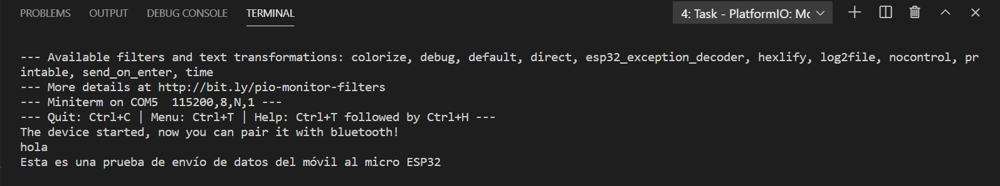
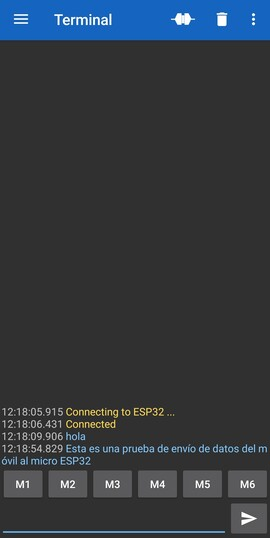

# Práctica 3.2 Comunicación Bluetooth con el móvil
###### Andrea Muñiz
<p></p>

## Programa + explicación

>Declaramos las cabeceras a utilizar para poder utilizar la función de Bluetooth que incluye la placa ESP32.

```
#include "BluetoothSerial.h"
```

>Declaramos una variable tipo BluetoothSerial

```
BluetoothSerial SerialBT;
```

>Función setup()

En esta función incicializamos el serial a una velocidad de 115200 (ha de coincidir con la monitor_speed del documento "platformio.ini")<p></p>
A continuación inicializamos también el dispositivo bluetooth poniendole un nombre e informamos por pantalla de que el dispositivo está inicializado y ya se puede emparejar con otro dispositivo mediante bluetooth.

```
void setup()
{  Serial.begin(115200);
   SerialBT.begin("ESP32"); //Bluetooth device name
   Serial.println("The device started, now you can pair it with bluetooth!");
}
```

>Función bucle 

En este bucle lo que conseguimos es que el dispositivo lea lo que recibe por bluetooth y lo escriba por el puerto serie.

```
void loop()
{ if ( Serial.available())
        SerialBT.write(Serial.read());
  if (SerialBT.available())
     Serial.write(SerialBT.read());
  delay(20);
}
```

***

## Salida de la impresión serie

```
The device started, now you can pair it with bluetooth!
```


En la imagen superior podemos observar los mensajes mandados desde el móvil mediante la aplicación Serial Bluetooth Terminal.
En la imagen inferior podemos observar lo que hemos enviado desde el móvil.

