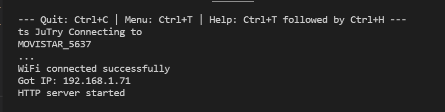
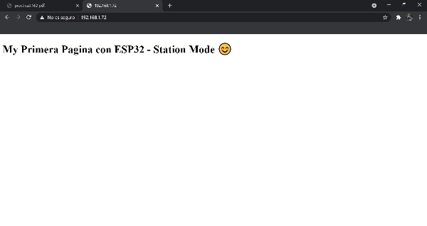

# Práctica 3.1 Generación de una página Web
###### Andrea Muñiz
<p></p>

## Programa + explicación

>Declaramos las cabeceras a utilizar

```
#include <Arduino.h>
#include <WiFi.h>
#include <WebServer.h>
```

> Definimos las constantes de nombre y contraseña de nuestro router

```
const char* ssid = "*************";
const char* password = "********************";
```

> definimos un WebServer en el puerto 80

```
WebServer server(80);
```

> Función setup()

En esta función inicializamos el serial e informamos por pantalla que la placa se está conectando a la red wifi.<p></p>
A su vez, comenzamos la conexión de la placa a la red poniendo el nombre y la contaseña.<p></p>
Además mientras se está realizando la conexión, se imprimen por pantalla puntos. Una vez se ha conseguido conectar al router, se imprimirá por pantalla "WiFi connected successfully".<p></p>
Por último en esta función, se imprimirá por el monitor serie una dirección IP donde deberemos acceder para poder ver la web.

```
void setup() {
    Serial.begin(115200);
    Serial.println("Try Connecting to ");
    Serial.println(ssid);

    WiFi.begin(ssid, password);

    while (WiFi.status() != WL_CONNECTED) {
        delay(1000);
        Serial.print(".");
    }

    Serial.println("");
    Serial.println("WiFi connected successfully");
    Serial.print("Got IP: ");
    Serial.println(WiFi.localIP());

    server.on("/", handle_root);

    server.begin();
    Serial.println("HTTP server started");
    delay(100);
}
```

> Función bucle

Mantiene la web "vigilada" por lo que pueda suceder.

```
void loop() {
    server.handleClient();
}
```

> HTML

Este código es lo que aparecerá en la web que hemos creado 

```
String HTML = "<!DOCTYPE html>\
<html>\
<body>\
<h1>My Primera Pagina con ESP32 - Station Mode &#128522;</h1>\
</body>\
</html>";

void handle_root() {
    server.send(200, "text/html", HTML);
}
```

***

## Salida de la impresión serie

```
Try Connecting to
************* //nombre red wifi
....
WiFi connected successfully
Got IP: ***.***.*.** // en mi caso 192.168.1.71
HTTP server started
```



