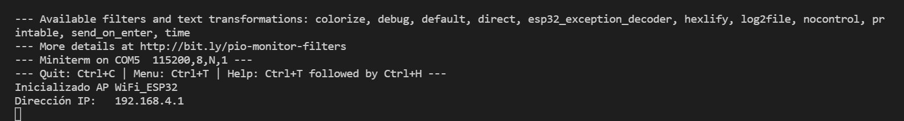
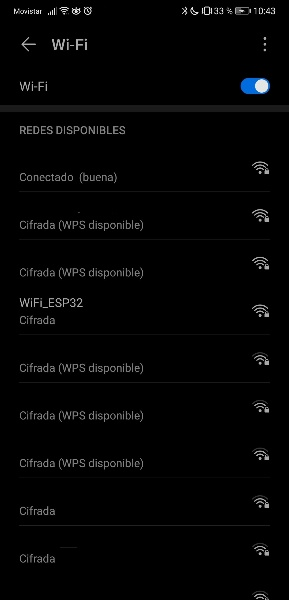

# Práctica 3 Ejercicio 1 subida nota (conexión AP)
###### Andrea Muñiz
<p></p>

## Programa + explicación 

> Declaramos las librerias necesarias

```
#include <Arduino.h>
#include <WiFi.h>
```

> Declaramos las constantes 

Estas constantes son el nombre y la contraseña de la nueva red creada.

```
const char *ssid = "WiFi_ESP32";
const char *password = "AndreaESP32";
```

> Función setup()

En esta función inicializamos el serial a una velocidad de 115200 y una espera de 10ms.
A continuación configuramos el WiFi en modo AP y creamos un bucle while en el que mientras no se inicie la conexion se escriben puntos por el monitorcasa 100ms. En el momento en que se haya iniciado la conexion se informa por el monitor y se escribe la IP.

```
void setup(){
    Serial.begin(115200);
    delay(10);

    WiFi.mode(WIFI_AP);
    while(!WiFi.softAP(ssid, password)){
        Serial.println(".");
        delay(100);
    }

    Serial.print("Inicializado AP ");
    Serial.println(ssid);
    Serial.print("Dirección IP: \t");
    Serial.println(WiFi.softAPIP());
}
```

> Función bucle

En este programa no es necesario la función _loop()_

```
void loop(){
    
}
```

***

## Resultados

A continuación se adjunta una imagen de la salida obtenida por el monitor y de las redes detectadas por mi móvil donde se puede observar que detecta la red creada y pone _cifrada_ por lo que es necesario introducir una contraseña.



